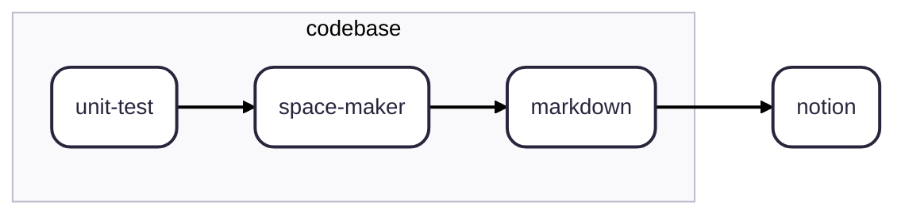

# 🫀 Space Maker

A **spec [space] maker** that generates specifications from your unit test files.

> _While external documents can always provide additional technical context or extended specifications, **the ultimate source of truth must remain in the codebase**. Specifications should live close to the code and be synchronized, ensuring alignment between developers, QA, and product teams._

- 👩‍💼 Product managers use **Notion**
- 👨‍💻 Software engineers use `markdown`

The purpose of this repository is to automate the updating of `markdown` and **Notion** documents in order to provide product managers with a clear view of a feature's health status and specifications.

Each `markdown` file corresponds to a `describe` block (specifically tagged by a `SPACE_MAKER_TAG`) and will be synced with the associated **Notion** page.

The test results listed in the `markdown` are intended to highlight which specifications are covered by tests - demonstrating that the requested functionalities are properly secured.
